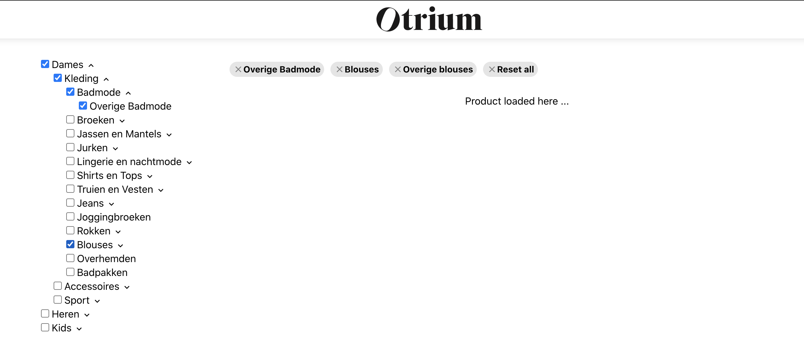
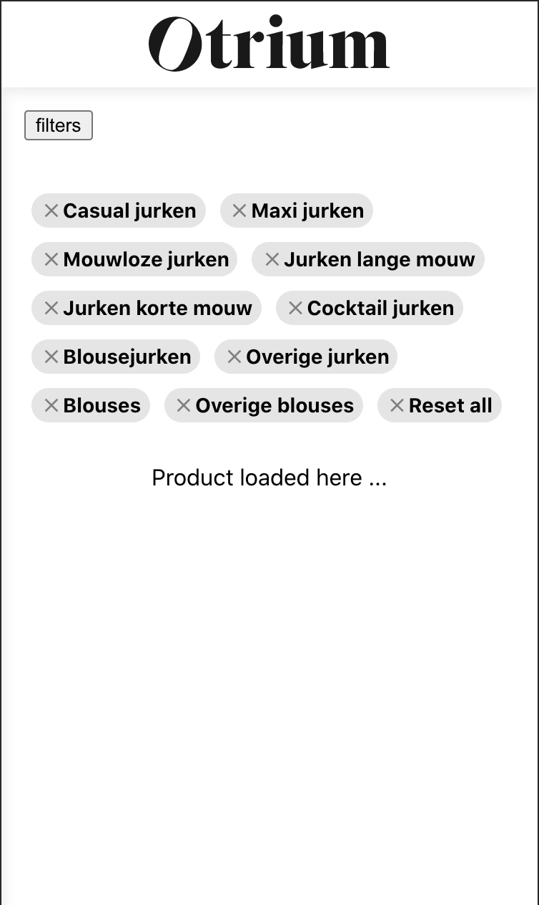
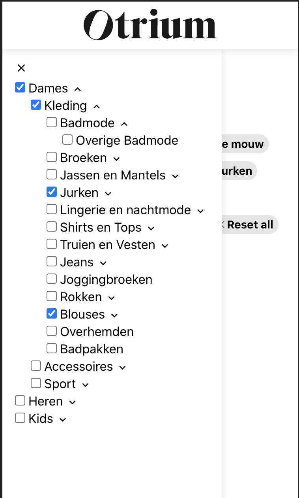

## Otrium front-end challenge

Page shows available filtering options on a side and applied by user filters on the top of the page. Based on applied filters content with available products information will be loaded (out of scope for this task)

Desktop view

Mobile view

### Implementation details server

Simple express server that returns response in json format
Link to the server api http://localhost:3001/filters - get request

To run project
- navigate to /server fiolder
- run `yarn install`
- run `yarn start`

### Implementation details server

Client side application written in Typescript, React.js, CSS modules
Fetching data from api is done with useFetch hook for simplicity and state is maintained in root App component.

To run project
- navigate to /client fiolder
- run `yarn install`
- run `yarn start`

`yarn test` to run unit tests
